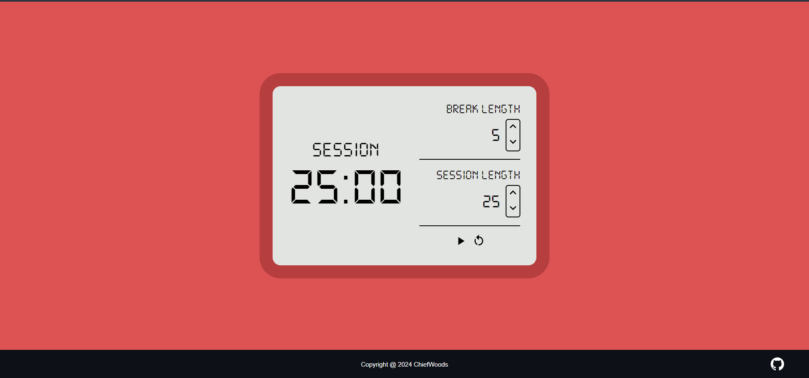

# 25 Plus 5 Clock



Pomodoro timer for Front End Development Libraries in [freeCodeCamp](https://www.freecodecamp.org/learn/).

[Live Website](https://chiefwoods.github.io/25-plus-5-clock/)

[Source Repository](https://github.com/ChiefWoods/25-plus-5-clock)

## Features

- Set pomodoro breaks and sessions

## Built With

### Languages

- [](https://html5.org/)
- [](https://www.w3.org/Style/CSS/Overview.en.html)
- [](https://www.typescriptlang.org/)
- [](https://svelte.dev/)

### Bundlers

- [](https://vitejs.dev/)

### Tools

- [](https://code.visualstudio.com/)

## Getting Started

### Prerequisites

Update your npm package to the latest version.
```
npm install npm@latest -g
```

### Setup

1. Clone the repository

```
git clone https://github.com/ChiefWoods/25-plus-5-clock.git
```

2. Install all dependencies

```
npm install
```

3. Start development server

```
npm run dev
```

## Issues

View the [open issues](https://github.com/ChiefWoods/25-plus-5-clock/issues) for a full list of proposed features and known bugs.

## Acknowledgements

### Resources

- [Shields.io](https://shields.io/)
- [Google Fonts](https://fonts.google.com/)
- [DaFont](https://www.dafont.com/)
- [Pictogrammers](https://pictogrammers.com/)
- [Zedge](https://www.zedge.net/)

### Hosting

- [GitHub Pages](https://pages.github.com/)

## Contact

[chii.yuen@hotmail.com](mailto:chii.yuen@hotmail.com)